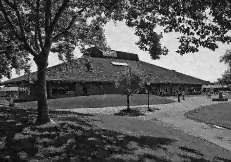
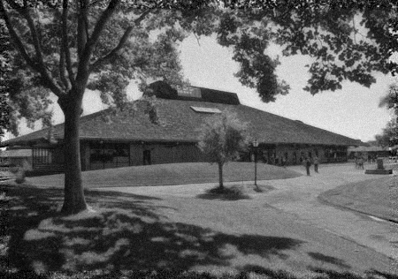

This project is an investigation into the topic of image denoising. We implemented two very different algorithms for removing noise from images:

- A smarter variant of median filtering that uses edge detection.
- A machine learning algorithm that identifies similar regions of the image and uses principal component analysis to separate noise from them.

## Median filtering with edge detection ##

A median filter replaces the value of each pixel with the median of the surrounding neighborhood of pixels. This algorithm is fairly robust to speckle noise, but can create a blobby "oil painting" effect which is undesirable.

To help mitigate this effect, we couple the median filter with a Canny edge detector, and only evaluated the median filter on pixels of the image where edges were detected.

Original image:

Noise artificially added:

Denoised with median filter and edge detection:

The resulting image is still undesirably splotchy and crackly, but retains high-frequency details better than a median filter alone.

During development, we also experimented with a "centrally weighted median filter," where the value of the center pixel is duplicated several times in the pixel value set. This reduces blobbiness, but reintroduces speckle noise.

## LPG-PCA ##

This implements Zhang et al., "Two-stage image denoising by principal component analysis with local pixel grouping" (published in *Pattern Recognition*).

We define the *target block* to be the 5x5 region centered on a pixel. We look for nearby 5x5 blocks that are similar to the target block, and select the best candidates. These candidates, along with the target block, are compiled into a training matrix **X**. **X** is transformed into the PCA domain, resulting in matrix **Y**. **Y** tends to be lopsided, with the noiseless features of the image concentrated in a few components. Thus noise can be removed from the image by zeroing out principal components identified as less important. After denoising, **Y** is transformed back into the space domain, from which the predicted value of the pixel can be extracted.

This process is repeated for every pixel on the image. Then the image is denoised again with the same algorithm, but with parameters adjusted based on statistical information learned from the first pass. The second stage should be much less aggressive than the first.

Original image:

Noise artificially added:

Denoising, first stage:

Denoising, second stage:

There are obvious flaws in this result, which are generally more attributable to our implementation rather than inherent isuses with the LPG-PCA algorithm. First, we did not implement proper handling of the border of the image, so we simply ignored it. As far as quality goes, LPG-PCA seems to reduce contrast, which could probably be corrected in implementation.

Another less visible flaw is performance. LPG-PCA is very slow, even when implemented in a fast language like Julia (for each pixel, several matrix multiplications and an eigenvalue decomposition). For this reason, we were forced to stick to monochrome to avoid the tripled computation time due to processing red, green, and blue channels. The two stages shown took 26 minutes to compile.
